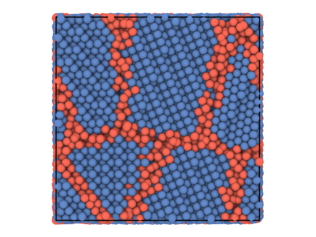

partycls
========

**partycls** is a Python package for spatio-temporal cluster analysis of interacting particles. It provides descriptors suitable for applications in condensed matter physics and integrates the necessary tools of unsupervised learning into a streamlined workflow. Thanks to a flexible system of filters, it makes it easy to restrict the analysis to a given subset of particles based on arbitrary particle properties.

Quick start
-----------

Here is a simple example that shows how to use partycls to find identify grain boundaries in a polycrystalline system. The system configuration is stored in a trajectory file with a single frame

```python
from partycls import Trajectory

traj = Trajectory('grains.xyz')
traj[0].show()
```


We use the local distribution of bond angles around each particle as a structural fingerprint and perform a clustering using the [K-Means](https://en.wikipedia.org/wiki/K-means_clustering) algorithm. We show the system again, this time coloring the particles according to the cluster they belong to.

```python
from partycls import Workflow

wf = Workflow(traj, descriptor='ba', clustering='kmeans')
wf.run()
traj[0].show(color='label')
```



Tha results are also written to a set of files including a labeled trajectory file and additional information on the clustering results. The whole workflow can be easily tuned and customized, check out the [tutorials](https://github.com/jorisparet/partycls/tree/master/tutorial) to see how and for further examples.

We can restrict the analysis to specific a subset of particles by adding filters. Say we have a binary mixture composed of particles with types A and B, and are only interested in the angular correlations of B particles in the left side of the box (with respect to x-axis):

```python
from partycls import Trajectory
from partycls.descriptor import BondAngleDescriptor

traj = Trajectory('trajectory.xyz')
D = BondAngleDescriptor(traj)
D.add_filter("species == 'B'")
D.add_filter("x < 0.0")
D.compute()

# List of active filters on particles' properties
print(D.active_filters)
# Angular correlations for the selected particles
print(D.features)
```

We can then perform a clustering based on these structural features, asking for *e.g.* 3 clusters:

```python
from partycls import KMeans

clustering = KMeans(n_clusters=3)
clustering.fit(D.features)
print('Cluster membership of the particles', clustering.labels)
```

partycls is designed to accept a large variety of trajectory formats (including custom ones!) either through its built-in trajectory reader or via third-party packages, such as [MDTraj](www.mdtraj.org) and [atooms](https://framagit.org/atooms/atooms). It relies on the [scikit-learn](https://scikit-learn.org) package to perform dimensional reduction prior to clustering and supports additional structural descriptors via [DScribe](https://singroup.github.io/dscribe).

Requirements
------------

* [numpy](https://pypi.org/project/numpy/)
* [scikit-learn](https://scikit-learn.org)
* [optional] [mdtraj](https://www.mdtraj.org) (additional trajectory formats)
* [optional] [atooms](https://framagit.org/atooms/atooms) (additional trajectory formats)
* [optional] [dscribe](https://singroup.github.io/dscribe) (additional descriptors)

Documentation
-------------

See the [tutorials](https://github.com/jorisparet/partycls/tree/master/tutorial) (Jupyter notebooks) for a step-by-step introduction to the main features of partycls and some of its applications.

Installation
------------

From pypi:

```bash
pip install partycls
```

From the code repository:

```bash
git clone https://github.com/jorisparet/partycls.git
cd partycls
make install
```

Authors
-------

Joris Paret

Daniele Coslovich: http://www-dft.ts.infn.it/~coslovich/
